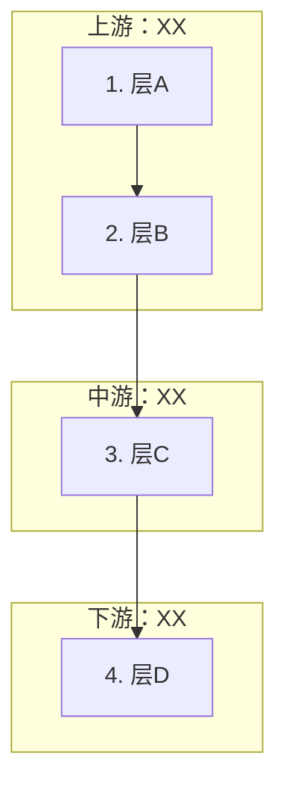

# T06 调研阅读型文章模板

## 何时用

文章核心问题是"X 领域怎么运转、有哪些角色、个人从哪切入"，且读者不需要注册账号或操作工具时，用本模板。典型场景：

- 行业分析、产业链拆解、生态位判断
- 工具/方案对比选型（纯调研，不动手）
- 平台规则/政策梳理

**不是**：工具实操（用 ASD 的"工具实操型"）、代码教程（用 T02）、数学推导（用 T01/T04）。

---

## 骨架总览

```text
§0 结论先行（一张表说清全文结论）
§1 你要做什么（Step 表，固定三列格式）
§2 为什么不直接 X（痛点桥：承接上一篇，展示跳过本节内容的后果）
§3 全景图（Mermaid flowchart / 分层表）
§4~N 逐层拆解（每层固定 4 段 + 个人策略表）
§N+1 决策/行动（个人切入点决策表）
§N+2 今日实操（含 source-note 创建任务）
§末 下一篇钩子
```

---

## §0 结论先行

开门见山，一张表给出全文结论。格式：

| 判断 | 当前情况 | 对个人的影响 |
|---|---|---|
| 核心判断 1 |  |  |
| 核心判断 2 |  |  |

可选追加一段一句话总结，如"读完这篇文章你可以画出 X，并在一张表上标出自己该站在哪"。

---

## §1 你要做什么

固定格式的 Step 表。三列：Step | 你要做什么 | 是否需要账号/工具 | 产出。

```text
| Step | 你要做什么 | 是否需要账号/工具 | 产出 |
|---:|---|---|---|
| 1 | 读完本文 X | 否 | 理解 X |
| 2 | 手工画一遍/填一张表 | 否 | X 文档 |
| 3 | 写 3 条个人判断 | 否 | 加入 X 文件 |
```

如果是 ASD 系列文章，必须在 Step 表下方标注资料目录路径。

---

## §2 为什么不直接 X（痛点桥）

**位置**：在"你要做什么"之后、正式拆解之前。

**作用**：承接上一篇的结论，引出"读者最可能犯的错误"，用具体场景展示跳过本节内容会摔在哪。

**写法**：
1. 一句话承接上一篇（"上一篇我们看到...到这里，一个自然的想法是..."）
2. 给一个具体翻车案例（"设想你选了 X 题材，打开 Y 工具..."）
3. 用落地结论点出：问题不在工具，在跳过了前 N 层

**反例**（不要这样写）："X 很重要，下面我们来学习 X"——这是填鸭。

---

## §3 全景图

用 Mermaid flowchart 或分层表，让读者在进入细节前先看到全局关系。

Mermaid 示例结构：



**注意**：如果某层不是流水线工序而是横切约束（如合规），用虚线连接各层。

---

## §4~N 逐层拆解

每层固定 4 段 + 1 张个人策略表。节号直接用"第 X 层：层名"。

### 每层 4 段结构

**① 这一层在干什么**
- 一句话定义这一层的核心任务
- 列出主要参与方/工具/运作方式（用表格如果超过 2 行）

**② 谁在这一层赚钱**（可选，如果该层不涉及商业可省略）
- 列出主要商业角色和他们的收入模式
- 如有关键数据点（金额、分账比例），给出引证 `[来源](URL)`

**③ 跳过这一层的后果**
- 用具体场景展示：不做这一层会怎样
- 不能只说"很重要"，要有读者能感知的后果（如"第一镜主角在办公室、第二镜莫名其妙到了街头"）

**④ 个人创作者怎么做**
- 固定三列表：能做到 | 不能做 | 第一个月策略
- "能做到"是正面引导，"不能做"是硬边界，"第一个月策略"是具体动作

```text
| 能做到 | 不能做 | 第一个月策略 |
|---|---|---|
| X | Y | Z |
```

---

## §N+1 决策/行动

把前面逐层拆解的"个人能做到/不能做"汇总成一张决策表。格式：

| 层 | 第一个月 | 判断依据 |
|---|---|---|
| 层A | ✅ 重点做 / ⏸️ 第 N 周再碰 / ❌ 不做 | 一句话理由 |
| 层B | ... | ... |

**关键**：这张表必须能用一句话概括第一个月的策略方向，如"上游不碰，中游全覆盖，下游边做边建，商业化留到月底"。

---

## §N+2 今日实操

分 3-4 个子任务，每个任务有明确的产出物和文件名。

### 任务 1：手工复现
- 让读者亲手画/写一遍核心内容（如手画产业链图）

### 任务 2：填决策表
- 给空表模板，让读者填入自己的判断

### 任务 3：写个人判断
- 2-3 条具体判断（如"第一个月重点攻哪几层"）

### 任务 4：建 source-note（调研阅读型必须）
- 给 4-5 条具体 source-note 创建任务
- 每条标注：ID、类型、建议文件名、要记录的内容

```text
| ID | 类型 | 建议文件 | 内容 |
|---|---|---|---|
| Rxxx | 政策/平台/工具/案例/商业化/风险 | `路径/文件名.md` | 要查什么 |
```

---

## §末 下一篇钩子

固定表格格式：

| 下一篇 | 要解决什么 | 产出 |
|---|---|---|
| ASD-A0XX XXXX | X | X |

"要解决什么"必须承接本文末段的自然问题——读者读完本文后心里冒出的"那我下一步该干什么"。

---

## 自检清单

定稿前逐项过：

- [ ] §0 结论表：读一遍就能知道全文结论
- [ ] §1 Step 表：固定三列格式，不空列
- [ ] §2 痛点桥：有承接上一篇的句子 + 具体翻车场景
- [ ] §3 全景图：Mermaid 可渲染，无 ASCII art
- [ ] 每层拆解：4 段不缺（干什么/谁赚钱/跳过后果/个人能做）
- [ ] §N+1 决策表：覆盖所有层，有概括策略方向的总结句
- [ ] §N+2 今日实操：含 4-5 条 source-note 创建任务，每条有 ID 和文件名
- [ ] 下一篇钩子：固定格式表格，"要解决什么"承接本文末段
- [ ] W9：grep ASCII art = 0
- [ ] W10：grep SKILL/vN.N/按规则/LZ反馈 = 0
- [ ] W8：所有数据断言有行内 `[来源](URL)`
- [ ] W5：结尾有下一篇钩子，正文无跨篇乱跳 link
- [ ] W6：开头承接上一篇结尾，结尾钩子对上下一篇开头
