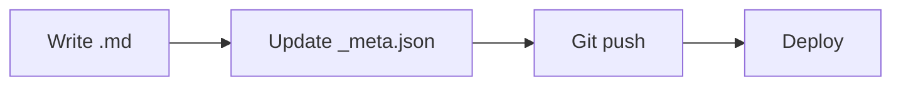
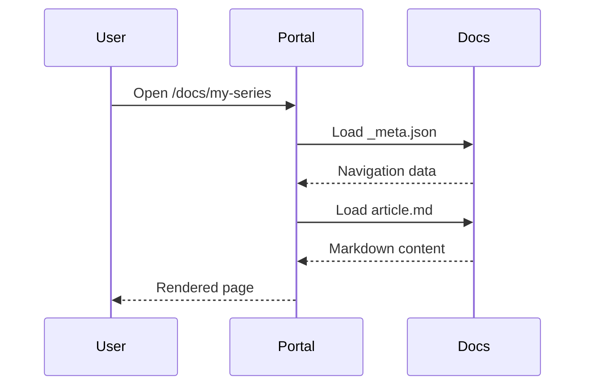

# Markdown Writing Guide

KBBook renders Markdown with extended features for technical documentation.

## Code blocks

Syntax-highlighted code blocks with Prism.js:

````markdown
```go
func hello() string {
    return "Hello, KBBook!"
}
```

```python
def greet(name: str) -> str:
    return f"Hello, {name}!"
```

```bash
pnpm dev
```
````

Output:

```go
func hello() string {
    return "Hello, KBBook!"
}
```

## Mermaid diagrams

KBBook supports all Mermaid diagram types:

````markdown

````


### Sequence diagrams



## KaTeX math

Inline math: `$E = mc^2$` renders as $E = mc^2$

Block math:

```latex
$$
\frac{\partial L}{\partial w} = \lim_{h \to 0} \frac{L(w + h) - L(w)}{h}
$$
```

Renders as:

$$
\frac{\partial L}{\partial w} = \lim_{h \to 0} \frac{L(w + h) - L(w)}{h}
$$

## Tables

| Feature | Support | Notes |
|---------|---------|-------|
| Mermaid | ✅ | All diagram types |
| KaTeX | ✅ | Inline and block |
| Code highlight | ✅ | Prism.js, major languages |
| Tables | ✅ | GFM syntax |
| Task lists | ✅ | `- [x]` syntax |
| Footnotes | ✅ | `[^1]` syntax |

## Tips for good KBBook articles

1. **Start with "why"** — Explain the problem before the solution
2. **Use diagrams** — A Mermaid flowchart is worth a thousand words
3. **Show code** — Runnable examples beat abstract descriptions
4. **Link between articles** — Use relative markdown links: `[Next](./other-article.md)`
5. **Keep sections focused** — One concept per `##` heading

→ **Next: [Build & Deployment](./05-deployment.md)** — Build your portal for production.
